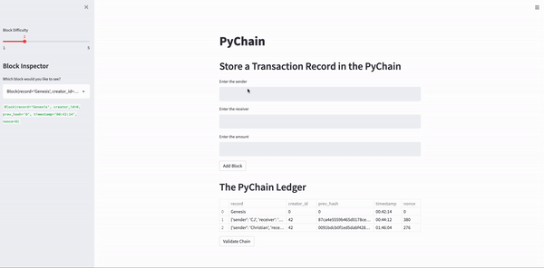

# PyChain Ledger

PyChain Ledger was created as a demonstration of a blockchain ledger system, using Streamlit, a Python web-based interface.

**Demonstration:**

Below is an example of how a transaction is recorded on PyChain. The Block Difficulty can also be adjusted as required. 

